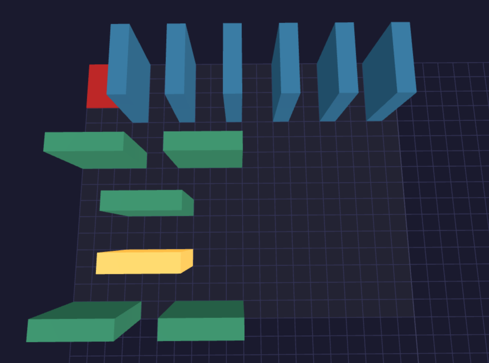
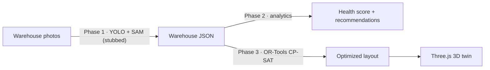

# ShelfSense AI 📦

> An AI warehouse digital twin: photograph your warehouse, get health analytics, a
> mathematically-optimized shelf layout, and an interactive 3D view — before moving
> a single real shelf.

ShelfSense turns warehouse photos into a structured digital model (Phase 1), scores how
well the space is used and recommends fixes (Phase 2), then uses constraint solving to
design a better layout (Phase 3) and renders it as a browser-based 3D twin.

**Honest status:** the computer-vision step (Phase 1) is currently a stub that returns
sample data — the contract, analytics, optimizer, async pipeline, persistence, and 3D
viewer all run end-to-end and are swap-ready for the real YOLO/SAM detector.



## How it works



Everything hangs off one **JSON contract** (Pydantic): Phase 1 produces it, Phase 2
consumes it, Phase 3 extends it, and the 3D twin renders it.

- **Phase 2 — Evaluation:** Storage Utilization Rate, a 6-dimension weighted Health
  Score (0–100 + band), and rule-based recommendations (consolidate under-filled
  shelves, reclaim large empty regions).
- **Phase 3 — Optimization:** a CP-SAT model that places shelves with no overlaps,
  enforced aisle clearance, an exit keep-out zone, and optional 90° rotation —
  maximizing the number of shelves placed (solves the reference scenario to OPTIMAL).
- **Async pipeline:** slow jobs run in a Celery worker via Redis; the API returns a
  `task_id` instantly and clients poll for progress.

## Tech stack

| Layer | Tools |
|---|---|
| API | FastAPI · Pydantic (contract validation at every border) |
| Optimization | Google OR-Tools CP-SAT |
| Persistence | SQLite · SQLAlchemy · Alembic migrations |
| Background jobs | Celery · Redis (in Docker) |
| 3D twin | Three.js (browser-side, built from layout JSON) |
| Tooling | uv · Docker Desktop |

## Quickstart

Prerequisites: [uv](https://docs.astral.sh/uv/), [Docker Desktop](https://www.docker.com/products/docker-desktop/), Python 3.13.

```bash
git clone https://github.com/ayush-kr-repo/ShelfSense.git
cd ShelfSense
uv sync

# 1. start the message queue
docker run -d -p 6379:6379 --name shelfsense-redis redis

# 2. create the database
uv run alembic upgrade head

# 3. start the API (terminal 1)
uv run uvicorn app.main:app --reload

# 4. start the background worker (terminal 2)
uv run celery -A app.worker.celery_app worker --loglevel=info --pool=solo
```

Then open:
- **http://127.0.0.1:8000/docs** — interactive API docs
- **http://127.0.0.1:8000/static/twin.html** — the 3D twin (orbit, zoom, click shelves)

## API

| Endpoint | In plain words |
|---|---|
| `POST /api/v1/analyze` | *"Start studying my warehouse"* — enqueues the pipeline, returns a `task_id` instantly |
| `GET /api/v1/task/{id}` | *"Is my order ready?"* — poll status + progress (queued → running → done) |
| `GET /api/v1/warehouse/{id}` | The facts — shelves, positions, occupancy (Phase 1 output) |
| `GET /api/v1/analytics/{id}` | The verdict — health score, SUR, recommendations (Phase 2) |
| `POST /api/v1/optimize` | The blueprint — constraints in, solved layout out (saved with an id) |
| `GET /api/v1/layout/{id}` | The archive — retrieve any previously solved layout |

## Project structure

```
app/            # application package
├── main.py     # API routes
├── schemas.py  # the JSON contract (Pydantic)
├── models.py   # DB tables (SQLAlchemy)
├── database.py # engine + sessions
├── worker.py   # Celery background tasks
└── phase1-3.py # perception (stub) · evaluation · optimization
alembic/        # schema migrations
static/         # Three.js 3D twin
```

## Roadmap

- [x] JSON contract (Pydantic, locked)
- [x] Phase 2 analytics — SUR, health score, recommendations
- [x] Phase 3 optimizer — CP-SAT with aisles, exit keep-out, rotation
- [x] 3D digital twin (Three.js)
- [x] Async pipeline — Celery + Redis, task polling
- [x] Persistence — SQLite + Alembic
- [ ] Real Phase 1 vision — fine-tuned YOLOv8 + SAM
- [ ] Test suite (pytest)
- [ ] JWT auth + user scoping
- [ ] React dashboard
- [ ] Postgres + docker-compose deployment
```
