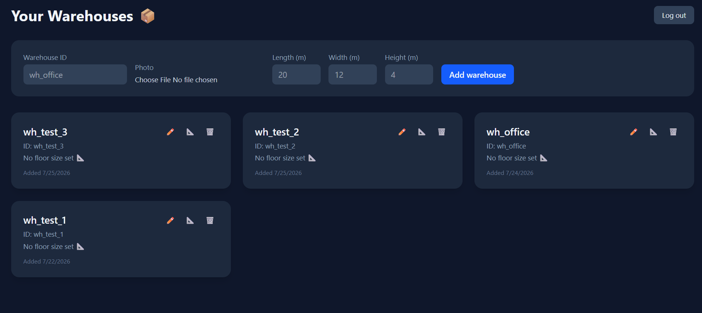
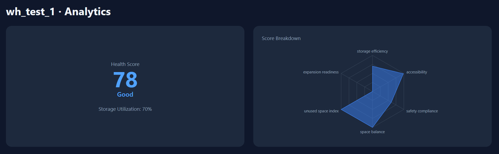
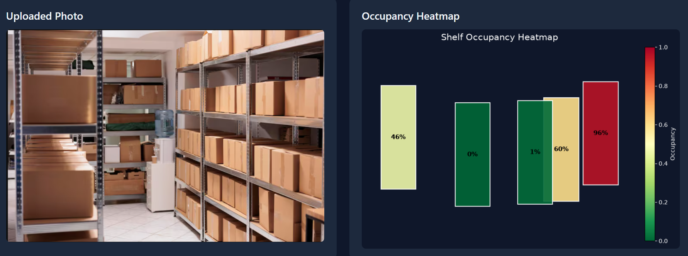
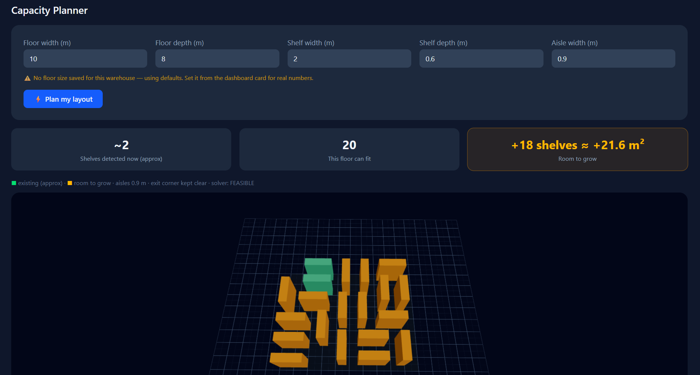
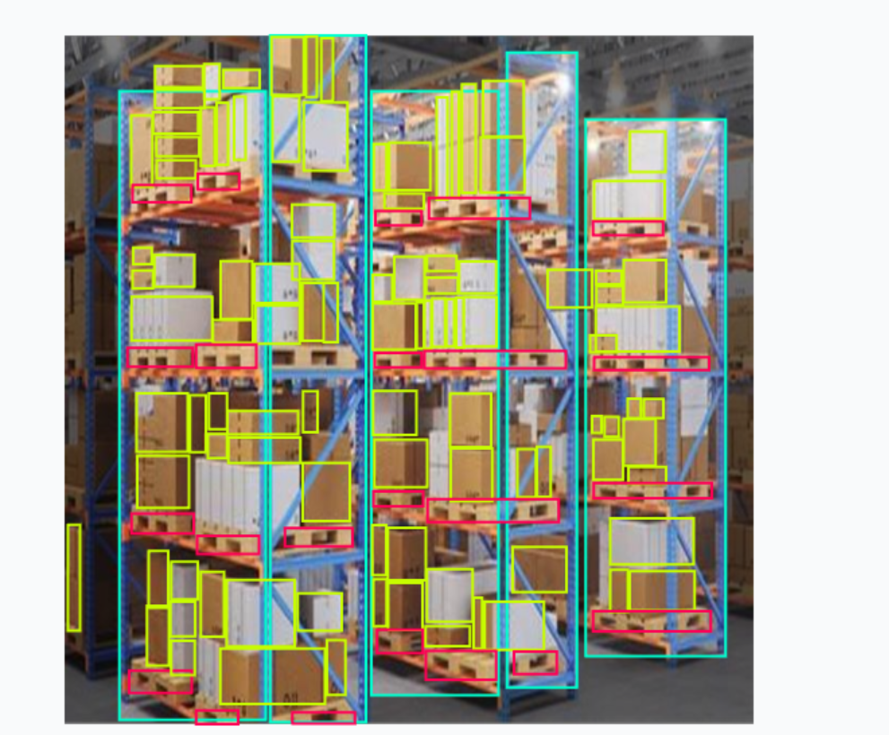
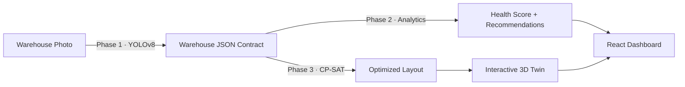
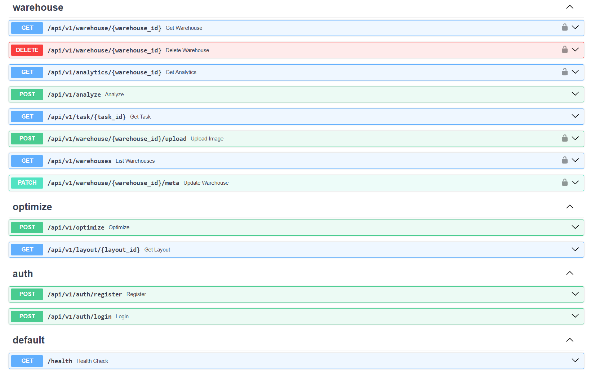

<div align="center">

# ShelfSense AI

### Warehouse Intelligence from a Single Photograph


<br/>


</div>

---

> **Take a photo of your warehouse. Get back a health score, a heatmap of how full each shelf is, and a layout that fits more stock in the same floor space — shown in 3D.**

---

## What It Solves

Warehouse space is expensive, but most storage decisions get made with a tape measure and a gut feeling. ShelfSense answers five questions quickly:

| Question | How ShelfSense answers it |
|---|---|
| **How full is my warehouse?** | Measures how much of each shelf is covered by stock |
| **How healthy is my storage?** | Scores it 0–100 across six factors |
| **How many more shelves fit?** | Solves for the best possible arrangement of your floor |
| **What should that layout look like?** | Draws it in 3D you can rotate and zoom |
| **What should I fix first?** | Lists specific problems, ranked by impact |

---

## Features

### Multi-Warehouse Management

Upload a photo along with your real floor size to create a warehouse. Rename it, change its dimensions, or delete it from the dashboard. You only ever see your own warehouses — every request checks that you own what you're asking for.



### Warehouse Health Analytics

One score out of 100, built from six separate measures: storage efficiency, accessibility, safety compliance, space balance, unused space, and room to expand. The radar chart shows which of the six is dragging the score down, and the recommendations below say what to do about it.



### Occupancy Heatmap

Each shelf the model finds gets drawn as a rectangle, colored green (empty) through red (full). It sits next to the original photo so you can check the model against your own eyes.



### Capacity Planner and 3D Twin

Type in your floor size, shelf size, and how wide you need the aisles. The solver works out how many shelves fit and where they go. Shelves you already have show green, extra ones you could add show amber — so the gap between "what you have" and "what fits" is visible at a glance.



### Purpose-Built Training Dataset

No public dataset had warehouse shelf bays labeled, so the dataset was built by hand. Every shelf label follows one rule — one box per rack bay, upright to upright, floor to top. The full standard is written down in [ml/ANNOTATION_GUIDE.md](ml/ANNOTATION_GUIDE.md).



---

## Architecture


```mermaid
flowchart LR
    A[Warehouse Photo] -->|"Phase 1 · YOLOv8"| B[Warehouse JSON Contract]
    B -->|"Phase 2 · Analytics"| C[Health Score + Recommendations]
    B -->|"Phase 3 · CP-SAT"| D[Optimized Layout]
    D --> E[Interactive 3D Twin]
    C --> F[React Dashboard]
    E --> F
```

Every stage reads and writes **the same JSON structure**, defined once with Pydantic and checked automatically. Phase 1 creates it, Phase 2 scores it, Phase 3 adds the optimized layout, and the dashboard draws it. Because the format is fixed, any stage can be swapped out without touching the others — upgrading the detection model is a one-line change.

---

## How It Works

### Phase 1 — Reading the photo

A YOLOv8 model, retrained on warehouse images, finds three things in a photo: **shelves** (rack bays), **boxes**, and **pallets**.

To work out how full a shelf is, the code lays an invisible grid over the shelf rectangle and checks each grid point: is it covered by a box or not? Occupancy is simply the fraction of points covered.

The obvious alternative — adding up the area of every box — is wrong, and this project learned that the hard way. Boxes overlap and stack, so the total exceeds the shelf's own area and every shelf reads 100% full. Grid sampling counts each spot once, no matter how many boxes sit on it.

To convert pixels into metres, ShelfSense uses either the floor size you typed in, or one known measurement passed as `?px_per_m=`. If it has neither, it says the numbers are relative instead of pretending they're metres.

### Phase 2 — Scoring the warehouse

Storage Utilization Rate is how much of the total shelf volume actually holds stock. Six sub-scores are combined into one weighted health score with a label (Poor, Fair, Good, Excellent), and a set of rules turns the numbers into plain recommendations.

When something can't be calculated — for example, no floor size was entered — the app says what it needs instead of inventing a number.

### Phase 3 — Finding the best layout

Google OR-Tools CP-SAT treats the layout as a puzzle. You give it the floor size, shelf size, aisle width, and where the exit is. It must obey four rules:

- Shelves can't overlap each other
- Every shelf needs an aisle-width gap around it, so people can walk
- No shelf may sit on the exit — each one has to be fully left, right, in front of, or behind it
- A shelf can be turned 90° if that makes it fit

The solver then finds the arrangement that fits **the most shelves**. If you ask for more shelves than the floor can hold, it places as many as it can rather than failing.

---

## Model Development

### How detection is measured

Detection quality is reported as **mAP@50**, the standard metric for object detection. Reading it left to right:

- **IoU (Intersection over Union)** — when the model draws a box, IoU measures how much it overlaps the box a human drew. 1.0 is a perfect match, 0 is no overlap at all.
- **@50** — a detection counts as correct if it overlaps the true box by at least 50%.
- **Precision** — of all the boxes the model drew, how many were real?
- **Recall** — of all the real objects present, how many did the model find?
- **AP (Average Precision)** — one number combining precision and recall across every confidence setting.
- **mAP** — AP averaged across all classes.

**Why the 50% threshold suits this project:** ShelfSense doesn't need pixel-perfect edges. Occupancy is measured by grid coverage, and the layout planner only needs a count of bays. A box that's roughly in the right place is useful; a box that's 90% perfect isn't meaningfully better.

### Three experiments

Each training run tested one specific idea about why detection was underperforming.

| Run | Training data | shelf | box | pallet |
|---|---|---|---|---|
| **v1** — merged public datasets | 1,706 images | 0.39 | 0.34 | **0.96** |
| **v2** — same data, 3.5× bigger model | 1,706 images | 0.41 | 0.38 | 0.96 |
| **v3** — hand-curated, one labeling standard | 85 images | **0.44** | 0.10 | 0.19 |

*Figures are mAP@50. The runs use different validation sets, so treat them as indicative rather than an exact head-to-head.*

**A bigger model didn't help.** Going from YOLOv8n to YOLOv8s tripled the parameter count and moved overall accuracy by 0.02. That ruled out model size as the problem and pointed at the data.

**Consistent labels beat more labels.** An early retrain with *more* annotations made box accuracy worse, because the new images labeled boxes at a different granularity than the older ones — the model was taught one rule and graded against another. Rebuilding the dataset around a single written standard fixed the contradiction, and 85 carefully labeled images then matched 1,706 mixed-source ones on shelf detection.

**One job beats three.** A run that trained on shelves alone reached **0.77** — nearly double the same dataset's three-class shelf score. With only 85 images, splitting the model's capacity across three classes costs more than it gains.

### Current production model

The v3 weights are the ones running. Full numbers on the held-out validation set:

| Class | Precision | Recall | mAP@50 |
|---|---|---|---|
| shelf | 0.46 | 0.51 | 0.44 |
| box | 0.32 | 0.15 | 0.10 |
| pallet | 0.33 | 0.26 | 0.19 |

**What these numbers mean in practice.** Shelf detection went from roughly one bay per photo to four or five correctly placed ones, which is why heatmaps now look like actual racking. Box **recall of 0.15** is the weak spot — the model finds about one box in seven, so occupancy reads low on densely packed shelves. That single number explains most of the remaining error in the product, and it's a data problem: more labeled boxes, not more code.

### Known limitations

- A single photo only shows the front row. Stock sitting deeper on a shelf can't be seen, so occupancy is always an estimate.
- Low box recall understates how full busy shelves are.
- Shelf detection works well on straight-on rack photos and gets worse at steep angles or in poor light.
- Safety compliance returns a fixed placeholder score, because aisle widths and load weights aren't measured yet.

Swapping in a better model is a one-line change — no other code has to move.

---

## Tech Stack

<div align="center">

| Layer | Technology |
|:---|:---|
| **API** | FastAPI · Pydantic · Uvicorn |
| **Computer Vision** | Ultralytics YOLOv8 (fine-tuned) · Roboflow |
| **Optimization** | Google OR-Tools CP-SAT |
| **Frontend** | React 19 · Vite · Tailwind v4 |
| **Visualization** | Three.js (react-three-fiber) · Recharts · Framer Motion · Matplotlib |
| **Persistence** | SQLite · SQLAlchemy · Alembic |
| **Async** | Celery · Redis |
| **Auth** | JWT (python-jose) · bcrypt |
| **Tooling** | uv · pytest · Docker |

</div>

---

## Quickstart

**Prerequisites:** Python 3.13 · [uv](https://docs.astral.sh/uv/) · Node 20+ · Docker Desktop

```bash
git clone https://github.com/ayush-kr-repo/ShelfSense.git
cd ShelfSense
uv sync
```

**Start the backend**

```bash
docker run -d -p 6379:6379 --name shelfsense-redis redis
uv run alembic upgrade head
uv run uvicorn app.main:app --reload
```

**Start the worker** — separate terminal, only needed for background analysis

```bash
uv run celery -A app.worker.celery_app worker --loglevel=info --pool=solo
```

**Start the dashboard** — separate terminal

```bash
cd frontend
npm install
npm run dev
```

| Service | URL |
|---|---|
| Dashboard | http://localhost:5173 |
| Interactive API docs | http://127.0.0.1:8000/docs |

**Run the tests**

```bash
uv run pytest
```

---

## API



| Endpoint | What it does |
|:---|:---|
| `POST /api/v1/auth/register` | Create an account |
| `POST /api/v1/auth/login` | Log in and get a token |
| `GET /api/v1/warehouses` | List your warehouses |
| `POST /api/v1/warehouse/{id}/upload` | Upload a photo and floor size |
| `GET /api/v1/warehouse/{id}` | Raw detection results for one warehouse |
| `GET /api/v1/analytics/{id}` | Health score, heatmap, and capacity figures |
| `PATCH /api/v1/warehouse/{id}/meta` | Rename or change floor size |
| `DELETE /api/v1/warehouse/{id}` | Delete a warehouse and its files |
| `POST /api/v1/optimize` | Work out the best shelf layout |
| `GET /api/v1/layout/{id}` | Fetch a saved layout |
| `POST /api/v1/analyze` | Start a background analysis, returns a task id |
| `GET /api/v1/task/{id}` | Check how that task is going |

Every warehouse endpoint requires a login token and checks that the warehouse belongs to you.

---

## Project Structure

```text
app/
├── main.py              # Builds the FastAPI app
├── api/                 # Routes: warehouse · optimize · auth
├── schemas.py           # The shared JSON structure (Pydantic)
├── models.py            # Database tables (SQLAlchemy)
├── database.py          # Database connection and sessions
├── auth.py              # Login tokens and password hashing
├── scale.py             # Pixels to metres
├── heatmap.py           # Draws the occupancy heatmap
├── worker.py            # Background tasks (Celery)
└── phase1.py … phase3.py    # Detection · Scoring · Layout solving

frontend/src/
├── api.js               # Talks to the backend, attaches the login token
├── Login.jsx            # Login screen
├── Dashboard.jsx        # Warehouse cards and management
├── Upload.jsx           # Photo upload with floor size
├── Analytics.jsx        # Score, charts, recommendations, images
├── Optimize.jsx         # Capacity planner
└── Twin.jsx             # 3D view

alembic/                 # Database migrations
ml/                      # Model weights, training notebook, annotation guide
tests/                   # Test suite
Dockerfile               # For deployment
```

---
