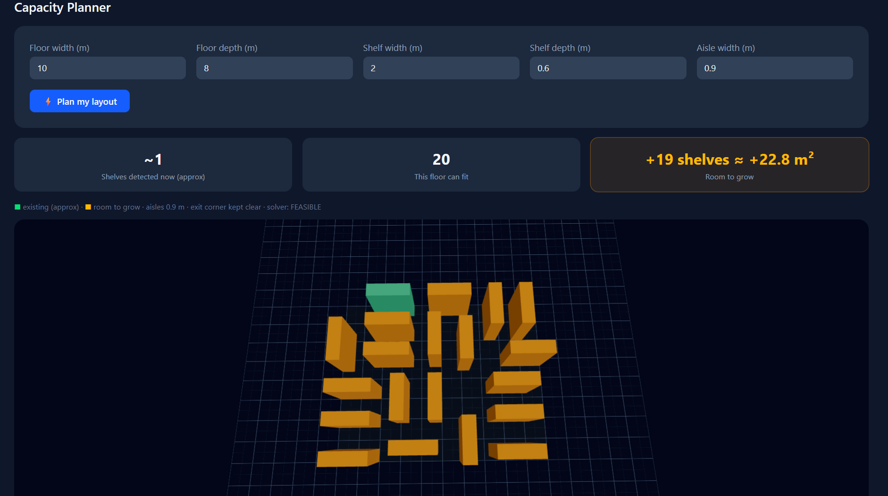
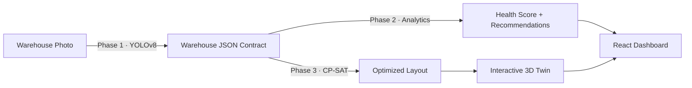

<div align="center">

# ShelfSense AI

### Warehouse Intelligence from a Single Photograph


<br/>


</div>

---

> **ShelfSense turns a warehouse photograph into a decision.** Computer vision reads the shelves, an analytics engine scores storage health, a constraint solver computes the mathematically optimal layout, and an interactive 3D twin lets you explore the result — before a single real shelf is moved.



---

## What It Solves

Warehouse space is expensive, and most storage decisions are made with a tape measure, a spreadsheet, and intuition. Managers rarely have a fast answer to the questions that matter most:

| Question | ShelfSense Answers With |
|---|---|
| **How full is my warehouse?** | Storage Utilization Rate computed from detected shelf occupancy |
| **How healthy is my storage?** | A weighted 0–100 health score across six dimensions |
| **How many more shelves fit?** | A CP-SAT solver that packs your real floor under real constraints |
| **What is the optimal layout?** | An optimized arrangement, rendered in interactive 3D |
| **What should I fix first?** | Ranked, rule-based recommendations with impact levels |

---

## Features

### Multi-Warehouse Management

Upload a photo with real floor dimensions to create a warehouse. Rename, resize, and delete from the dashboard. Every warehouse is scoped to its owner and protected by JWT authentication.


### Warehouse Health Analytics

A weighted health score built from six sub-scores — storage efficiency, accessibility, safety compliance, space balance, unused space index, and expansion readiness — visualized as a radar breakdown alongside actionable recommendations.


### Occupancy Heatmap

Every detected shelf bay is rendered and color-coded by how full it is, placed side by side with the source photograph so you can verify exactly what the model saw.


### Capacity Planner and 3D Digital Twin

Enter your floor size, shelf footprint, and aisle width — the constraint solver packs the space and reports how many shelves fit, how much storage area that represents, and how much room remains to grow. Existing capacity renders green, growth potential renders amber, and the entire layout is explorable in 3D with orbit, pan, and zoom.

### Purpose-Built Training Dataset

No public dataset contained warehouse shelf bays, so one was built: images assembled from multiple sources, with shelf bays hand-annotated under a documented convention — one label per rack bay, upright to upright, floor to top. The full standard is in [ml/ANNOTATION_GUIDE.md](ml/ANNOTATION_GUIDE.md).


---

## Architecture


```mermaid
flowchart LR
    A[Warehouse Photo] -->|"Phase 1 · YOLOv8"| B[Warehouse JSON Contract]
    B -->|"Phase 2 · Analytics"| C[Health Score + Recommendations]
    B -->|"Phase 3 · CP-SAT"| D[Optimized Layout]
    D --> E[Interactive 3D Twin]
    C --> F[React Dashboard]
    E --> F
```

Every stage communicates through **one validated JSON contract** defined in Pydantic. Phase 1 produces it, Phase 2 consumes it, Phase 3 extends it, and the frontend renders it. That contract is why each layer can be replaced independently — upgrading the detection model is a one-line change.

---

## How It Works

### Phase 1 — Perception

A fine-tuned YOLOv8 detector locates shelves, boxes, and pallets in a single photograph. Detections become structured metadata: shelf positions, per-bay occupancy, zone classification, and floor-plan areas.

Occupancy is measured by **grid sampling** the shelf rectangle and testing coverage against detected boxes, so overlapping detections are never double-counted — a summed-area approach saturates at 100% the moment box detection gets good.

Pixel measurements become real-world metres either from entered floor dimensions or from a single reference measurement passed as `?px_per_m=`. When no scale is available, the system reports relative units and declares it, rather than inventing numbers.

### Phase 2 — Analytics

Storage Utilization Rate is computed volumetrically across all detected shelves. Six sub-scores are weighted into a single health score with a categorical band, and a rule engine produces recommendations from real square-metre analysis. When a required input is missing, the engine reports what it needs instead of guessing.

### Phase 3 — Optimization

Google OR-Tools CP-SAT solves the layout as a constraint satisfaction problem:

- **No-overlap** in 2D across all placed shelves
- **Aisle clearance** enforced through interval padding
- **Exit keep-out zones** via reified boolean disjunction
- **Optional 90° rotation** per shelf
- **Optional placement**, so an over-constrained floor degrades gracefully instead of becoming infeasible

The objective maximizes the number of shelves placed — precisely the number a planner needs to know.

---

## Model Development

Three training iterations were run, each testing a specific hypothesis about why detection underperformed.

| Iteration | Dataset | shelf | box | pallet |
|---|---|---|---|---|
| v1 — merged public sources | 1,706 images | 0.39 | 0.34 | **0.96** |
| v2 — same data, 3.5× larger model | 1,706 images | 0.41 | 0.38 | 0.96 |
| v3 — curated, single annotation standard | 85 images | **0.44** | 0.10 | 0.19 |

*mAP@50. Iterations use different validation splits, so figures are indicative rather than directly comparable.*

**Model capacity is not the bottleneck.** Scaling from YOLOv8n to YOLOv8s moved overall mAP by 0.02 — a controlled result establishing that the limit is training data, not architecture.

**Label consistency dominates label volume.** A retrain with expanded annotations *reduced* box accuracy sharply, because newly annotated images used a different granularity convention than the validation set. That result drove the dataset rebuild around a single documented standard, and a curated 85-image set then outperformed 1,706 mixed-convention images on the target class.

**Focused models beat generalists at small scale.** An isolated single-class run reached 0.77 on shelf detection — nearly double the same dataset's three-class result — because model capacity was not split across classes with wildly different instance counts.

The v3 weights are in production: bay detection drives the heatmap and the storage-utilization denominator, and it improved from roughly one bay per photograph to four or five correctly placed ones.

**Known limitations**, stated deliberately:

- Occupancy is estimated from a single 2D viewpoint; stock depth behind the visible front row cannot be observed
- Box recall inside detected bays remains the weakest link, and understates occupancy on densely packed racking
- Shelf detection is reliable on straight-on rack imagery and degrades on oblique or low-light scenes
- Safety compliance returns a neutral placeholder pending aisle-width and load-weight inputs

Detection is upgradeable by replacing a single weights file — no application changes required.

---

## Tech Stack

<div align="center">

| Layer | Technology |
|:---|:---|
| **API** | FastAPI · Pydantic · Uvicorn |
| **Computer Vision** | Ultralytics YOLOv8 (fine-tuned) · Roboflow |
| **Optimization** | Google OR-Tools CP-SAT |
| **Frontend** | React 19 · Vite · Tailwind v4 |
| **Visualization** | Three.js (react-three-fiber) · Recharts · Framer Motion · Matplotlib |
| **Persistence** | SQLite · SQLAlchemy · Alembic |
| **Async** | Celery · Redis |
| **Auth** | JWT (python-jose) · bcrypt |
| **Tooling** | uv · pytest · Docker |

</div>

---

## Quickstart

**Prerequisites:** Python 3.13 · [uv](https://docs.astral.sh/uv/) · Node 20+ · Docker Desktop

```bash
git clone https://github.com/ayush-kr-repo/ShelfSense.git
cd ShelfSense
uv sync
```

**Start the backend**

```bash
docker run -d -p 6379:6379 --name shelfsense-redis redis
uv run alembic upgrade head
uv run uvicorn app.main:app --reload
```

**Start the worker** — separate terminal, optional, for asynchronous analysis

```bash
uv run celery -A app.worker.celery_app worker --loglevel=info --pool=solo
```

**Start the dashboard** — separate terminal

```bash
cd frontend
npm install
npm run dev
```

| Service | URL |
|---|---|
| Dashboard | http://localhost:5173 |
| Interactive API docs | http://127.0.0.1:8000/docs |

**Run the tests**

```bash
uv run pytest
```

---

## API


| Endpoint | Purpose |
|:---|:---|
| `POST /api/v1/auth/register` | Create an account |
| `POST /api/v1/auth/login` | Authenticate and receive a JWT |
| `GET /api/v1/warehouses` | List the authenticated user's warehouses |
| `POST /api/v1/warehouse/{id}/upload` | Upload a photo with optional floor dimensions |
| `GET /api/v1/warehouse/{id}` | Phase 1 detection output |
| `GET /api/v1/analytics/{id}` | Health analytics, heatmap, and capacity data |
| `PATCH /api/v1/warehouse/{id}/meta` | Update name or floor dimensions |
| `DELETE /api/v1/warehouse/{id}` | Delete a warehouse and its media |
| `POST /api/v1/optimize` | Run CP-SAT layout optimization |
| `GET /api/v1/layout/{id}` | Retrieve a stored optimized layout |
| `POST /api/v1/analyze` | Queue asynchronous analysis, returns a task id |
| `GET /api/v1/task/{id}` | Poll task status and progress |

All warehouse endpoints require JWT authentication and enforce per-user ownership.

---

## Project Structure

```text
app/
├── main.py              # FastAPI application assembly
├── api/                 # Route modules: warehouse · optimize · auth
├── schemas.py           # The shared JSON contract (Pydantic)
├── models.py            # SQLAlchemy ORM models
├── database.py          # Engine and session management
├── auth.py              # JWT issuance, verification, password hashing
├── scale.py             # Pixel-to-metre conversion
├── heatmap.py           # Occupancy heatmap rendering
├── worker.py            # Celery task definitions
└── phase1.py … phase3.py    # Perception · Analytics · Optimization

frontend/src/
├── api.js               # Fetch wrapper: base URL, JWT injection, 401 handling
├── Login.jsx            # Authentication
├── Dashboard.jsx        # Warehouse grid and management
├── Upload.jsx           # Multipart photo upload with dimensions
├── Analytics.jsx        # Health score, radar, recommendations, media
├── Optimize.jsx         # Capacity planner and solver interface
└── Twin.jsx             # react-three-fiber 3D digital twin

alembic/                 # Database migrations
ml/                      # Model weights, training notebook, annotation guide
tests/                   # Pytest suite
Dockerfile               # Container definition for deployment
```

---
